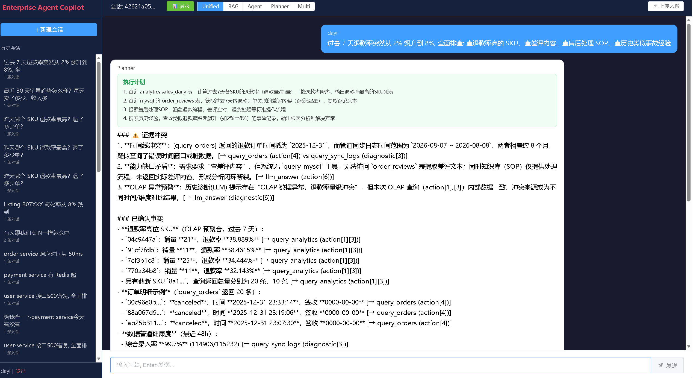
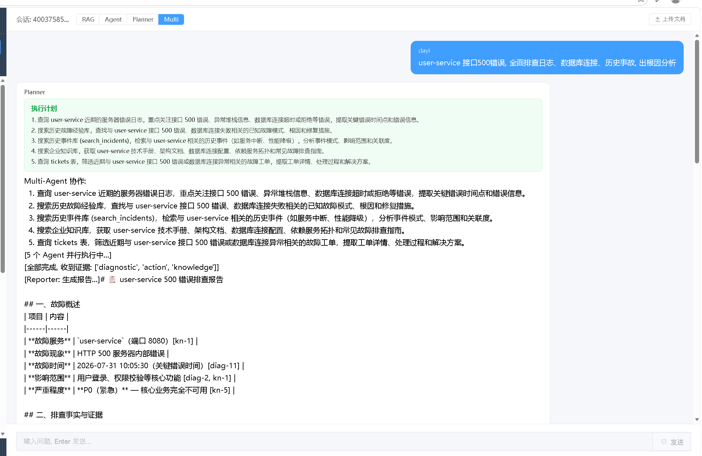
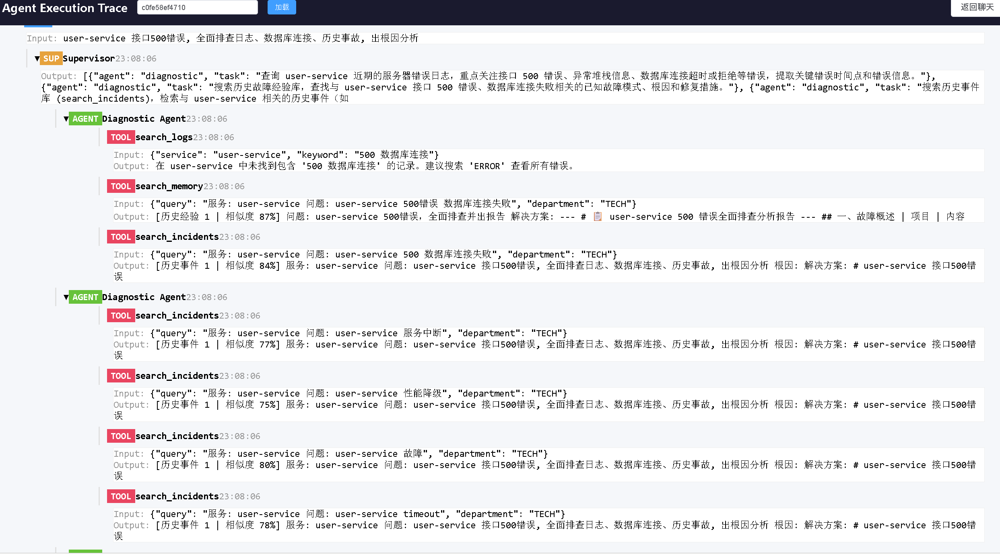
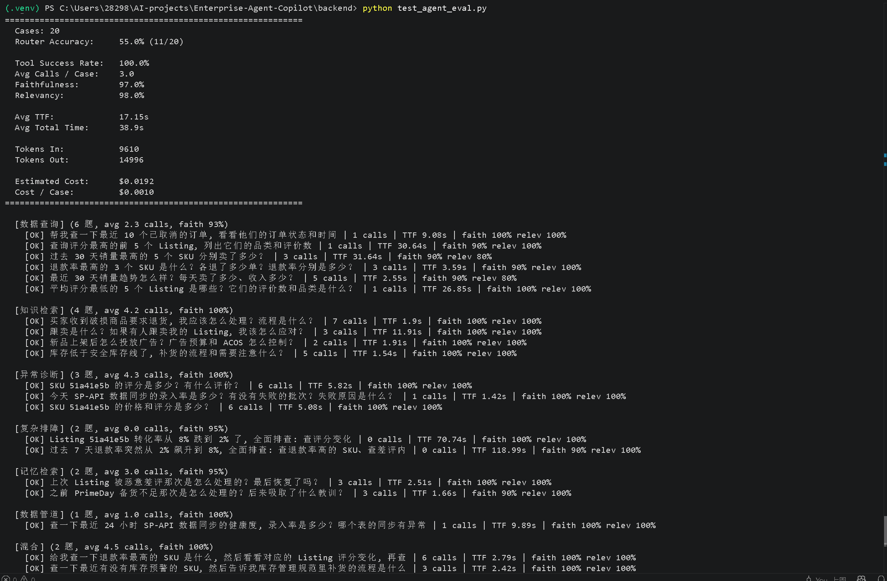

# Enterprise-Agent-Copilot 电商运营 AI Agent 平台

基于 Multi-Agent 协作的 Amazon 电商运营智能诊断系统。Supervisor 拆解任务，Action/Diagnostic/Knowledge 三路并行查数据，Reporter 生成报告 + Reviewer 自动审查。覆盖 Listing 诊断、退款异常、库存预警、数据管道监控等电商运营场景。

**Python · FastAPI · LangGraph · MySQL · ChromaDB · DeepSeek · Vue3 · Docker**



## 架构

```
用户 (运营/客服/供应链)
    │
    ▼
┌─────────────────────────────────────────┐
│            FastAPI 后端                   │
│                                          │
│  JWT 认证 (部门权限隔离)                   │
│  Unified Router (简单→单Agent / 复杂→Multi)│
│  Query Rewrite (多轮上下文补全)            │
└─────────────────────────────────────────┘
    │
    ▼
┌─────────────────────────────────────────┐
│         Multi-Agent 协作层                │
│                                          │
│  Supervisor → Action / Diagnostic /      │
│               Knowledge (asyncio 并行)   │
│       │                                  │
│       ▼                                  │
│  Reporter → Reviewer (审查+补查闭环)       │
└─────────────────────────────────────────┘
    │
    ▼
┌─────────────────────────────────────────┐
│          工具层 (FC + MCP)                │
│                                          │
│  query_analytics  query_orders           │
│  query_listing    query_sync_logs        │
│  search_knowledge_base  search_memory    │
└─────────────────────────────────────────┘
    │
    ▼
┌─────────────────────────────────────────┐
│          数据层 (双引擎)                   │
│                                          │
│  MySQL OLTP          analytics OLAP      │
│  137万条真实电商数据   20万条预聚合趋势     │
│  (Kaggle 数据集)      (ETL 凌晨聚合)       │
│                                          │
│  ChromaDB: 5篇 SOP + 7条长期记忆          │
└─────────────────────────────────────────┘
```

## 核心特性

### Multi-Agent 智能诊断

- **Supervisor 拆解**: LLM 自动分析问题，拆解为子任务分配给对应 Agent
- **三路并行**: Action(数据查询) / Diagnostic(管道诊断) / Knowledge(SOP检索) 通过 `asyncio.gather` 并行执行
- **Reporter + Reviewer 闭环**: 自动生成结构化报告 → LLM Judge 审查 → 缺失证据自动补查



- **Unified Router**: LLM 意图分类，简单查询走单 Agent，复杂排障走 Multi-Agent
- **智能停止**: 连续无效调用、达到配额上限时自动收尾，避免死循环



### 双引擎数据架构

- **MySQL OLTP**: 订单/商品/评价/支付 137 万条真实电商数据（Kaggle 数据集）
- **analytics OLAP**: 日销量预聚合表 20 万条，每天凌晨 ETL 从 OLTP 聚合
- **性能对比**: MySQL 三表 JOIN 聚合 38.9s → 预聚合表 0.004s（**516 倍差距**）
- **sync_logs 管道监控**: 22 条模拟 SP-API 同步日志，含 API 限流、密钥过期等真实故障

### 参数化工具 + MCP

- **参数化工具**: Agent 传业务参数而非拼 SQL，消除 LLM 写 SQL 的稳定性问题
- **6 个 MCP Server**: 订单/分析/库存/Listing/管道/知识库独立模块
- **FC + MCP 双模式**: 同进程工具用 Function Calling，跨服务用 MCP 远程调用

### RAG 知识库

- 5 篇电商运营 SOP（售后处理、广告投放、Listing优化、跟卖应对、库存管理）
- 按运营部/客服部/供应链部权限隔离
- PDF 双通道解析：PyPDF2 文本提取 + PaddleOCR 扫描件降级

### Agent Memory 双轨制

- **短期记忆**: LangGraph Checkpoint 会话上下文
- **长期记忆**: ChromaDB 故障经验库（带去重 + 过期过滤）
- **微调实验**: BGE Embedding LoRA 微调，适配电商垂直领域

### 评测 + 日报

- **20 道评测题**覆盖 7 个场景，LLM Judge 自研评分
- **每日运营晨报**: 一键并行查询销量/退款/库存/管道/Listing，生成结构化日报

## 快速开始

```bash
git clone https://github.com/dayi040705/Enterprise-Agent-Copilot.git
cd Enterprise-Agent-Copilot/backend

# 安装依赖
pip install -r requirements.txt

# 配置 DeepSeek API Key
echo "DEEPSEEK_API_KEY=sk-your-key" > .env

# 启动 MySQL (需本地安装)
net start MySQL80

# 初始化数据
python database/create_table.py
python database/create_admin.py
python database/seed_business.py
python scripts/import_ecommerce.py

# 启动
uvicorn main:app --reload
```

## 技术栈

| 层级 | 技术 |
|------|------|
| Web 框架 | FastAPI + Uvicorn |
| Agent 框架 | LangGraph (状态图编排) + 手写 ReAct |
| 关系数据库 | MySQL (OLTP) + analytics (OLAP) |
| 向量数据库 | ChromaDB |
| LLM | DeepSeek V4 Pro |
| Embedding | BAAI/bge-small-zh (LoRA 微调) |
| Reranker | BAAI/bge-reranker-base |
| 前端 | Vue3 + Element Plus |
| 部署 | Docker Compose |

## 评测结果

```
Cases:              20
Router Accuracy:     55.0%   (11/20, 评测标签偏保守, 实际准确率更高)
Tool Success Rate:   100.0%  零工具执行异常
Faithfulness:        97.0%   答案忠实于工具数据
Relevancy:           98.0%   答案紧扣用户问题
Avg Calls / Case:    3.0     每次任务平均 3 次工具调用
Avg TTF:             17.2s   首 token 延迟
Avg Total Time:      38.9s   完整任务耗时
Cost / Case:         $0.001  单次任务约 0.1 美分
```

| 场景 | 题数 | Faithfulness |
|------|:----:|:------------:|
| 数据查询 | 6 | 93% |
| 知识检索 | 4 | **100%** |
| 异常诊断 | 3 | **100%** |
| 复杂排障 | 2 | 95% |
| 记忆检索 | 2 | 95% |
| 数据管道 | 1 | **100%** |
| 混合 | 2 | **100%** |



## API 概览

| 端点 | 方法 | 说明 |
|------|------|------|
| `/chat/unified/stream` | POST | 统一入口: Query Rewrite + Router 自动分发 (默认) |
| `/chat/agent/stream` | POST | Agent 流式聊天 (工具调用可见) |
| `/chat/multi-agent/stream` | POST | Multi-Agent 协作 (5 Agent + Reviewer) |
| `/chat/daily-briefing` | POST | 每日运营晨报 (自动并行查询) |
| `/chat/trace/{id}` | GET | Agent 执行树 (Trace 可视化) |
| `/chat/history` | GET | 历史会话记录 |
| `/upload` | POST | 上传文档 |
| `/documents` | GET | 文档列表 |

## 项目结构

```
Enterprise-Agent-Copilot/
├── frontend-vue/src/views/
│   ├── Chat.vue                 # 聊天主界面 (暗色主题)
│   └── Trace.vue                # Agent 执行树可视化
├── backend/
│   ├── main.py                  # FastAPI 入口
│   ├── api/                     # API 路由层
│   │   ├── chat.py              # 聊天/日报/Trace 端点
│   │   ├── upload.py            # 文档上传
│   │   └── admin.py             # 管理后台
│   ├── services/                # 业务逻辑层
│   │   ├── multi_agent.py       # Multi-Agent 协作 + Reviewer
│   │   ├── graph.py             # LangGraph 状态图 + ReAct 循环
│   │   ├── executor.py          # 工具注册 + 参数校验 + 执行
│   │   ├── agent.py             # 单 Agent 入口 + 工具定义
│   │   ├── agent_eval.py        # Agent 多维度评测
│   │   ├── database.py          # OLTP + OLAP 双数据源查询
│   │   ├── rag.py               # RAG 编排 + Query Rewrite
│   │   ├── hybrid.py            # 混合检索 (RRF 融合)
│   │   ├── reranker.py          # BGE Reranker 精排
│   │   ├── chroma.py            # ChromaDB 向量库
│   │   ├── document.py          # PDF 双通道解析 + OCR
│   │   ├── splitter.py          # 语义分块
│   │   └── mcp_client.py        # MCP Client 统一调度
│   ├── mcp_servers/             # MCP Server 独立模块 (6个)
│   ├── schemas/                 # ClickHouse schema 设计
│   ├── scripts/                 # 数据导入/微调/Benchmark
│   └── models/                  # BGE 模型 (含微调版)
```
