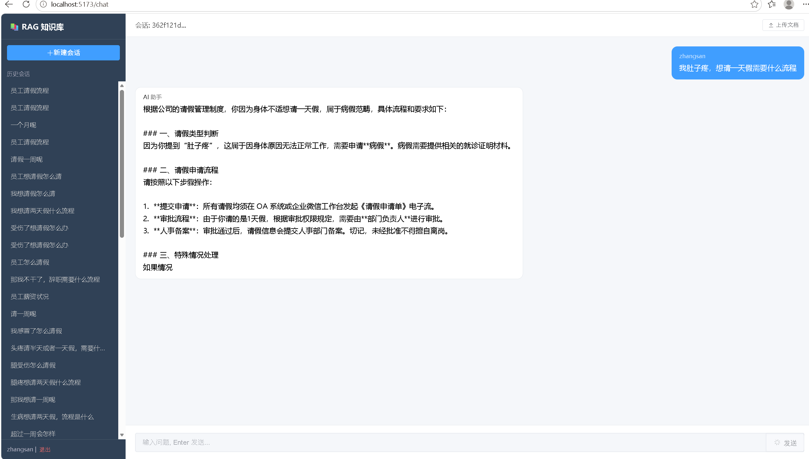
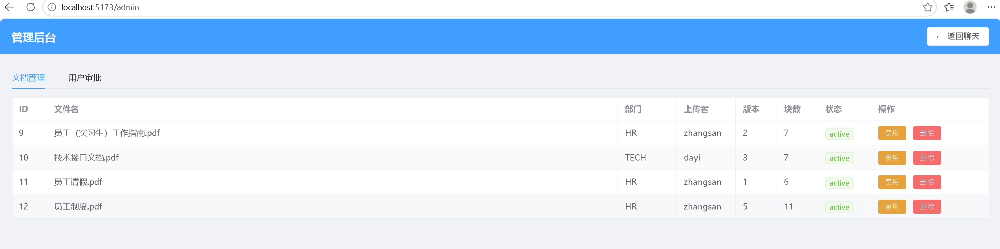
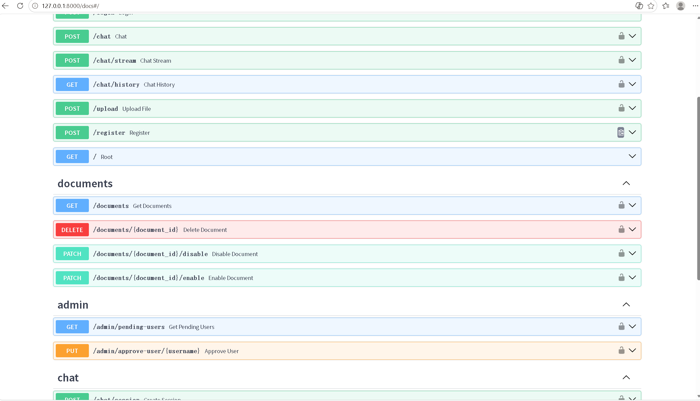
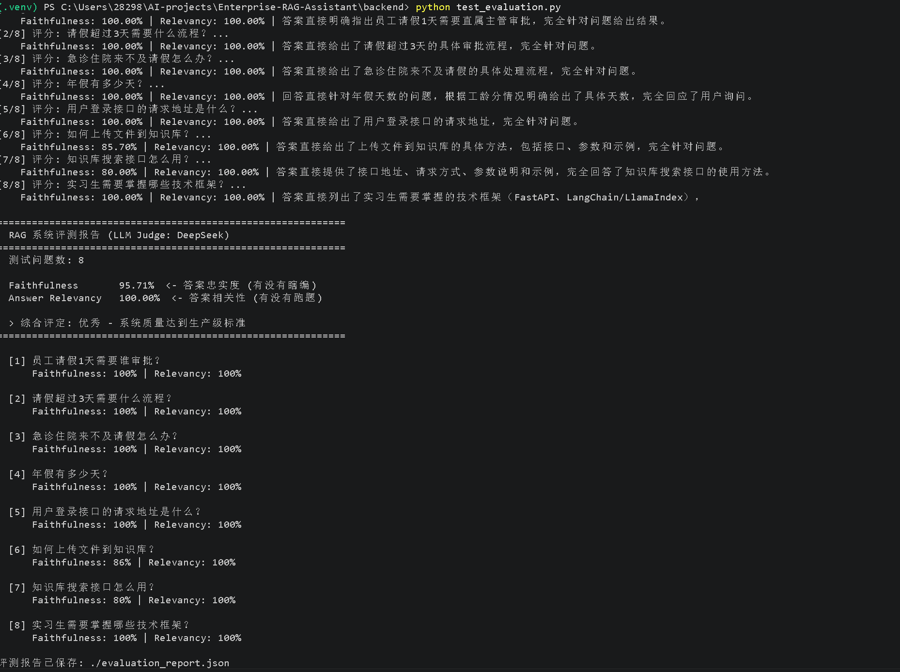
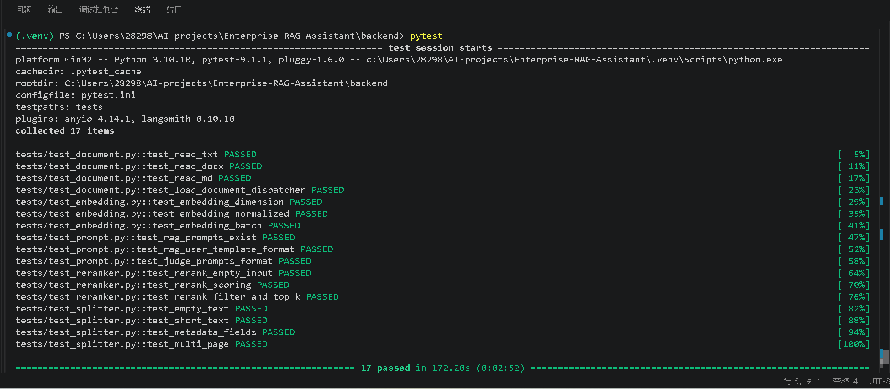

# Enterprise RAG Assistant — 企业级知识库问答系统

基于 RAG（检索增强生成）架构的企业内部知识库智能问答系统。支持多部门权限隔离、文档版本管理、混合检索 + Reranker 精排、流式输出，附带 LLM Judge 自动评测体系。

**59 个 Python 文件 · 3300+ 行代码 · 184 个依赖包**



## 架构

```
用户 ──→ FastAPI (/chat/stream)
              │
     ┌────────┼────────┐
     ▼        ▼        ▼
  登录认证  文档上传   聊天对话
  (JWT)   (版本控制)  (SSE流式)
     │        │        │
     └────────┼────────┘
              ▼
     ┌───────────────────┐
     │   RAG 检索管线     │
     │                   │
     │  用户问题          │
     │    ↓              │
     │  Query Rewrite    │  ← 多轮对话上下文改写
     │    ↓              │
     │  ┌─────┐ ┌─────┐  │
     │  │向量 │ │BM25 │  │  ← 多路召回
     │  │检索 │ │检索 │  │
     │  └──┬──┘ └──┬──┘  │
     │     └───┬───┘     │
     │         ▼         │
     │    RRF 融合        │  ← 排名加权
     │         ▼         │
     │    BGE Reranker   │  ← 精排
     │         ▼         │
     │    DeepSeek LLM   │  ← 生成
     └───────────────────┘
              │
     ┌────────┼────────┐
     ▼        ▼        ▼
  MySQL   ChromaDB  本地模型
 (用户/文档 (向量库) (BGE Embedding
  对话记录)          BGE Reranker)
```

## 核心特性

### 检索增强生成 (RAG)
- **语义分块**: 按中文标点切分，句子不拦腰斩断
- **多路召回**: 向量语义检索 (BGE-small-zh) + BM25 关键词检索 (Jieba 分词)
- **RRF 融合**: Reciprocal Rank Fusion 加权合并两路结果
- **Reranker 精排**: BGE-reranker-base Cross-Encoder 二次排序，threshold=-2 过滤
- **Query Rewrite**: 多轮对话自动补全省略信息，将"那个东西怎么搞"改写为完整查询

### 企业级功能
- **部门权限隔离**: JWT 认证，用户只能检索所属部门文档
- **文档版本管理**: 同名上传自动归档旧版，保留完整历史
- **软删除 + 启停**: `/disable` `/enable` 不丢数据
- **用户审批流程**: 自主注册 → 管理员审批 → 分配部门
- **SSE 流式输出**: 打字机效果，首 token 延迟 < 2 秒



### 评测体系
- **LLM Judge 自动评分**: DeepSeek 充当裁判，8 道测试题自动打分
- **Faithfulness 95.7%**: 答案忠实于检索到的文档内容
- **Answer Relevancy 100%**: 答案紧扣用户问题

### 日志系统
- 双通道输出: 控制台 (DEBUG) + 文件 (INFO)
- 按天轮转，保留 30 天

## 技术栈

| 层级 | 技术 |
|------|------|
| Web 框架 | FastAPI + Uvicorn |
| 向量数据库 | ChromaDB (PersistentClient) |
| 关系数据库 | MySQL + SQLAlchemy |
| LLM | DeepSeek V4 Pro (OpenAI 兼容 API) |
| Embedding | BAAI/bge-small-zh (本地 512 维) |
| 中文分词 | Jieba |
| 关键词检索 | rank-bm25 (BM25Okapi) |
| Reranker | BAAI/bge-reranker-base (FlagEmbedding) |
| 认证 | JWT (python-jose) + bcrypt |
| 文档解析 | PyPDF2 |
| 评测 | 自研 LLM Judge (DeepSeek) |

## 快速开始

### 1. 环境准备

```bash
# Python 3.10+
git clone <your-repo-url>
cd Enterprise-RAG-Assistant

# 创建虚拟环境
python -m venv .venv
.venv\Scripts\activate  # Windows

# 安装依赖
cd backend
pip install -r requirements.txt
```

### 2. 配置

```bash
# backend/.env
DEEPSEEK_API_KEY=sk-your-key-here
DEEPSEEK_MODEL=deepseek-v4-pro
```

### 3. 初始化数据库

```bash
cd backend

# 创建 MySQL 数据库
mysql -u root -p -e "CREATE DATABASE enterprise_rag"

# 创建表 + 初始用户
python database/create_table.py
python database/create_admin.py  # admin / 123456
python database/init_user.py     # zhangsan / 123456 (HR)
```

### 4. 下载 Embedding 模型

```bash
python download_model.py  # 下载 bge-small-zh 到 ./models/
```

### 5. 启动

```bash
uvicorn main:app --reload
```

浏览器打开 `http://127.0.0.1:8000` 进入聊天界面。

### 6. 使用

1. 登录 (zhangsan / 123456)
2. 上传文档 → `POST /upload` (或 Swagger `http://127.0.0.1:8000/docs`)
3. 开始提问 → 聊天界面或 `POST /chat/stream`

## API 概览

| 端点 | 方法 | 说明 |
|------|------|------|
| `/` | GET | 聊天界面 |
| `/login` | POST | 用户登录, 返回 JWT |
| `/register` | POST | 自主注册 |
| `/chat` | POST | 普通聊天 (一次性返回) |
| `/chat/stream` | POST | 流式聊天 (SSE 逐字推送) |
| `/chat/session` | POST | 创建新会话 |
| `/chat/history` | GET | 获取历史记录 |
| `/upload` | POST | 上传文档 (PDF/TXT) |
| `/documents` | GET | 文档列表 |
| `/documents/{id}` | DELETE | 删除文档 (admin) |
| `/documents/{id}/disable` | PATCH | 禁用文档 (admin) |
| `/documents/{id}/enable` | PATCH | 启用文档 (admin) |
| `/admin/pending-users` | GET | 待审批用户 (admin) |
| `/admin/approve-user/{username}` | PUT | 审批用户 (admin) |



## 评测结果

8 道测试题覆盖 HR/TECH 两个部门 4 份文档：

```
Faithfulness       95.7%  ████████████████████████████
Answer Relevancy   100.0% ████████████████████████████

综合评定: 优秀 — 8道测试题均正确检索并生成高质量回答
```

```bash
# 跑评测
python test_evaluation.py
# 报告输出: evaluation_report.json
```





## 项目结构

```
Enterprise-RAG-Assistant/
├── frontend/
│   └── chat.html                # 聊天 UI
├── backend/
│   ├── main.py                  # FastAPI 入口
│   ├── config.py                # 环境变量配置
│   ├── api/                     # API 路由层 (7个Router)
│   │   ├── auth.py              #   POST /login
│   │   ├── register.py          #   POST /register
│   │   ├── chat.py              #   POST /chat, /chat/stream
│   │   ├── session.py           #   POST /chat/session
│   │   ├── upload.py            #   POST /upload
│   │   ├── document.py          #   GET/DELETE/PATCH /documents
│   │   └── admin.py             #   GET /admin/*
│   ├── services/                # 业务逻辑层
│   │   ├── rag.py               #   RAG 编排 + 查询改写
│   │   ├── hybrid.py            #   混合检索 (RRF 融合)
│   │   ├── retriever.py         #   向量检索
│   │   ├── bm25.py              #   BM25 关键词检索
│   │   ├── reranker.py          #   BGE Reranker 精排
│   │   ├── splitter.py          #   语义分块
│   │   ├── embedding.py         #   BGE Embedding
│   │   ├── llm.py               #   DeepSeek API (普通+流式)
│   │   ├── chroma.py            #   ChromaDB 向量库
│   │   ├── document.py          #   文档解析 (PDF/TXT)
│   │   ├── evaluation.py        #   LLM Judge 评测
│   │   ├── prompt.py            #   Prompt 管理中心
│   │   ├── auth.py              #   JWT 签发/校验
│   │   └── dependency.py        #   FastAPI 依赖注入
│   ├── db_models/               # SQLAlchemy ORM
│   │   ├── user.py              #   用户表
│   │   ├── document.py          #   文档表
│   │   └── chat.py              #   对话记录表
│   ├── schemas/                 # Pydantic 数据模型
│   ├── database/                # 数据库连接 + 种子脚本
│   ├── utils/                   # 工具 (logger, password)
│   └── core/                    # 自定义异常
├── models/
│   └── bge-small-zh/            # 本地 Embedding 模型
└── download_model.py            # 模型下载脚本
```
